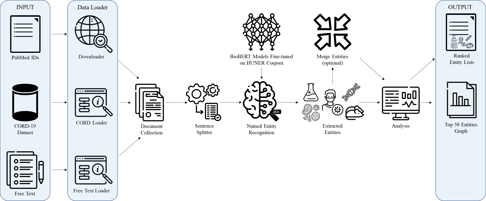

# LUMINER: A Customizable and Easy-to-Use Pipeline for Deep Learning- and Dictionary-based Named Entity Recognition from Medical Text

LUMINER is a customizable End-to-End Information Retrieval Pipeline developed at Lund University for extracting named entities from medcine-related texts. The pipeline comes with pre-trained models and dictionaries that can retrieve many biomedical entities: cell-lines, chemicals, disease, gene/proteins, species, COVID-19 related terms.  



## Quick start guide


1. Before installation: Downnload and install anaconda from https://www.anaconda.com/


2. Clone the repository to your target folder


```console
git clone https://github.com/Aitslab/LUMINER

```

3. Set up an conda environment

```console
conda env create -f environment.yml
```

4. After installation activate the environment:
```console
conda activate env_pipeline
```

5. Provide documents in the form of PubMed IDs, CORD metadata, or through free text.


6. Edit the [config file](config.json) with correct paths to your documents.


7. Run the following command:

```python
python main.py
```

8. The output will be in the form of a ranked list [(example)](results/sample_output/analysis_mtorandtsc1_chemical/mtorandtsc1_result_chemical.tsv) and a graph [(example)](results/sample_output/analysis_mtorandtsc1_chemical/mtorandtsc1_chemical_top_50.png)


### The complete configuration and inference tutorial can be found in this [collection of tutorials](tutorials/Tutorial-pipeline.md)  

___

## Models


The following models are fine-tuned and available for download:

### [BioBERT](https://github.com/dmis-lab/biobert-pytorch) 

1. Cell-lines: biobert_huner_cell_v1 
2. Chemical: biobert_huner_chemical_v1
3. Disease: biobert_huner_disease_v1
4. Gene/protein: biobert_huner_gene_v1
5. Species: biobert_huner_species_v1

The models can be loaded from huggingface using the following link in the config file: hf_hub:aitslab/biobert_huner_v1/model

https://github.com/Aitslab/LUMINER/blob/80dd78e21c1fc75ed346897d977b25896f76838e/config.json#L39-L53


### Dictionary based
[Spacy Phrasematcher](https://spacy.io/api/phrasematcher)  is used to load dictionaries and run NER. COVID-19 related disease and virus dictionaries are provided [here](dictionaries/). 
The dictionaries can be loaded 

#### For BioBERT model training script follow this [tutorial](tutorials/Tutorial-BioBERT_model_training.ipynb)
#### All preprocessing scripts can be found [here](supplementary/preprocessing_scripts/)
