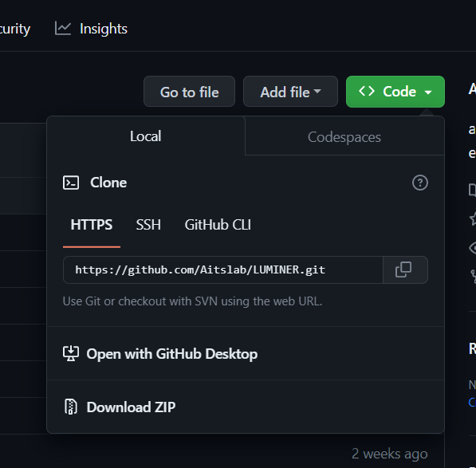
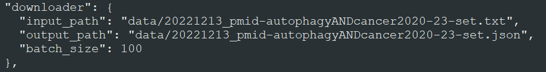
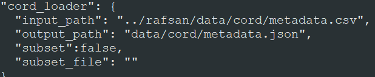
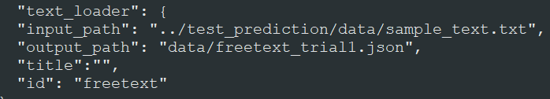
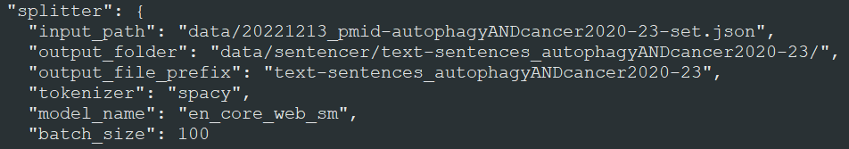
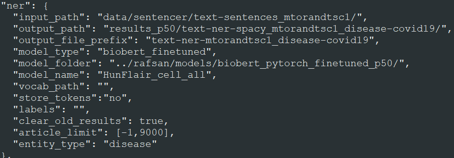
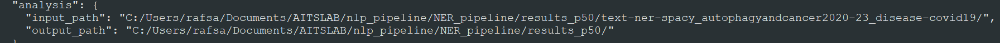
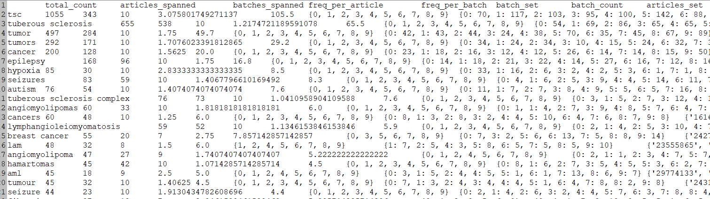
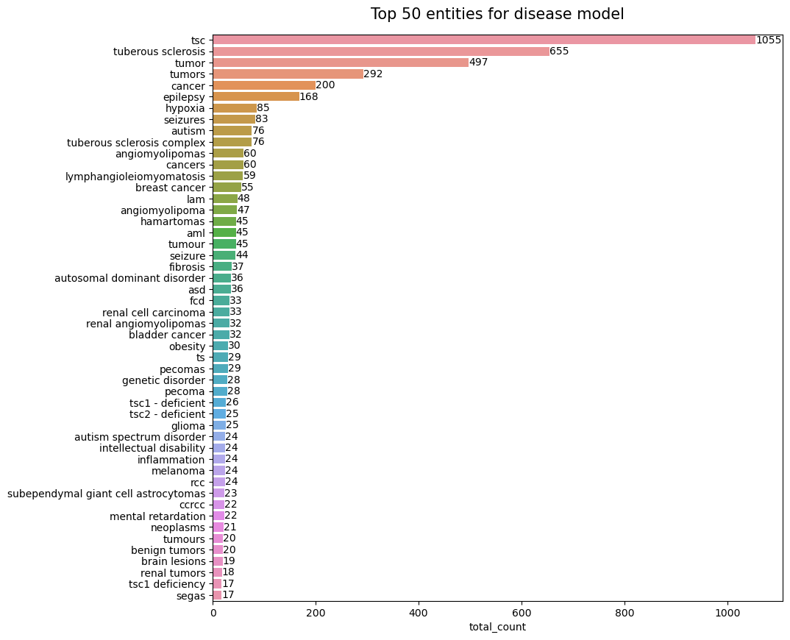

# EasyNER - Tutorials


The end-to-end NER pipeline for information extraction is designed to take user given input and extract a list of entities. The figure above describes how the given text is processed through the pipeline. Following are step-by-step tutorials on running the NER pipeline

___

# 1. Installation

## 1.1 Download the GitHub repository

If you have git installed on the computer, open a terminal window and download the repository by writing: 

```
cd PATH TO YOUR FOLDER OF CHOICE (e.g. C:/Users/XYZ/)
git clone https://github.com/Aitslab/EasyNER/
```

Alternatively, you can download the repository from github page https://github.com/Aitslab/EasyNER to your designated folder as a zip file (click on 'Code' in the top right corner and then on 'Download ZIP') and unpack it.



## 1.2 Install the conda environment

For running the pipeline, anaconda or miniconda must be installed in the computer. The step-by-step installation instructions can be found on: https://docs.anaconda.com/anaconda/install/index.html.

To install the necessary packages for running the environment, open a conda terminal and write the following commands:

```bash
conda env create -f environment.yml
```

After installation, load the environment with this:

```bash
conda activate easyner_env
```

___


# 2. Modify the Config file

The pipeline consists of several modules which are run in a sequential manner. It is also possible to run the modules individually. 

For each pipeline run, the config.json file in the repository needs to be modified with the desired settings. First, the modules that you want to run, should be switched to "false" in the ignore section. Then, the section for those modules should be modified as required. It is advisable to save a copy of the modified config file somewhere so you have a permanent record of the run. 

```bash
{
  "ignore": {
    "cord_loader": true,
    "downloader": true,
    "text_loader": true,
    "splitter": true,
    "ner": true,
    "analysis": false,
    "merger": true,
    "add_tags": true,
    "re": true,
    "metrics": true
  },
```
In a normal pipeline run, the following modules should be set to false, and the rest to true:

1. One of the data loaders depending on the input type (downloader, cord_loader or free_text loader).
2. splitter
3. ner
4. analysis

The following sections will provide more detail on each of the modules.

___

## 2.1 Data loader modules

The pipeline has three diffent modules for data loading, which handle different input types:

- List of Pubmed IDs => Downloader module
- CORD-19 metadata.csv file => CORD loader module
- Free text => Text loader module

### 2.1.1 Downloader
This downloader variant of the data loader module takes a single .txt file with pubmed IDs (one ID per row) as input and uses an API to retrieve abstracts from the Pubmed database. As example, look at the file ["Lund-Autophagy-1.txt"](/data/Lund-Autophagy-1.txt). The titles and abstracts of the corresponding articles are then stored in a single JSON file. To run the downloader module, change "downloader" in the ignore section to false (cord_loader and text_loader to true) and provide the following arguments in the "downloader" section of the config file

#### Config file argument:
```console
    "input_path": path to file with pubmed IDs 
    "output_path": path to storage location for output
    "batch_size": download batch size. Note that, too large of a batch size may invalid download requests.
```
#### example: 




### 2.1.2 CORD loader

This cord_loader variant of the data loader module processes titles and abstracts in the [CORD-19 dataset](https://github.com/allenai/cord19), a large collection of SARS-CoV2-related articles updated until 2022-06-02. For the CORD loader to work, the CORD19 dataset, which includes the metadata.csv file processed by the pipeline, first needs to be downloaded manually from the CORD-19 website ([direct download link](https://ai2-semanticscholar-cord-19.s3-us-west-2.amazonaws.com/historical_releases/cord-19_2022-06-02.tar.gz)). The file path to the metadata.csv file should then be provided in the config file as input. By default, the module will process all titles and abstracts in the CORD-19 dataset (approximately 700 000 records). If a smaller subset is to be processed, a .txt file with the selected cord UIDs, which can be extracted from the metadata.csv file, needs to be provided. To run the CORD loader script, turn "cord_loader" in the ignore section to false (and data_loader and text_loader to true) and provide the following arguments:

#### Config file argument:
```console
    "input_path": input file path with CORD-19 metadata.csv file
    "output_path": path to storage location for output
    "subset": true or false - whether a subset of the CORD-19 data is to be extracted.
	"subset_file": input file path to a file with cord UIDs if subset option is set to true
```
#### example: 





### 2.1.3 Freetext loader

The text_loader variant of the dataloader module processess a file with free text. Similar to data_loader and cord_loader, the file path should be provided in the config files.

#### Config file argument:
```console
    "input_path": input file path with free text
    "output_path": output file as document collection
    "title": Title for the text to be used in the document collection
	"id": user given ID for the free text
```
#### example: 



___


## 2.2 Sentence Spliter module

The loaded text is split with the help of Spacy or NLTK sentencer. The document collection will be split into batches with a specific batch size. How the files should be saved, for example batch size, should be specified in the config file. First you need to set the ignore parameter for splitter to false. Following are the arguments that can be provided to the splitter section

#### Config file argument:
```console
    "input_path": input file path of document collection
    "output_folder": output folder path where each bach will be saved
    "output_file_prefix": user-set prefix for output files
    "tokenizer": "spacy" or "nltk"
    "model_name": example: "en_core_web_sm" or "en_core_web_trf" for spacy, for nltk give "" 
	"batch_size": number of articles to be saved in one batch

```
#### example: 



___


## 2.3 Named Entity Recognition module

In this section the NER models are deployed on split sentences and entities are extracted. To run this section, the ignore argument for ner should be set to false. Then the following config arguments should be provided:

#### Config file argument:
```console
    "input_path": input folder path where all batches of split sentences are located
    "output_folder": output folder path where each bach will be saved
    "output_file_prefix": user-set prefix for tagged output files
    "model_type": type of model, use between "biobert_finetuned" and "spacy_phrasematcher". Note that the latter is dictionary based
    "model_folder": folder where model(s) are located. For huggingface models use the repo name instead. Eg. "aitslab"
    "model_name": name of the model within the model folder or repository.
    "vocab_path": if a specific vocab file is provided, used for dictionary based tagging (spacy_phrasematcher)
    "store_tokens":"no",
    "labels": if specific lavels are to be provided. ex: ["[PAD]", "B", "I", "O", "X", "[CLS]", "[SEP]"],
    "clear_old_results": overwrite old results
    "article_limit": if user decides to only choose a range of articles to run the model on, default [-1,9000]
	"entity_type": type of extracted entity
```
#### example: 




___


## 2.4 Analysis module

This section uses the extracted entities to generate a file of ranked entities and frequency plots. First, as all the other steps above, set ignore analysis to false. Then use the following input and output config arguments:

#### Config file argument:
```console
    "input_path": input folder path where all batches of NER are located
    "output_path": output folder path where the analysis files will be saved
```
#### example: 




#### output:

1. File with ranked entity list:

The generated output file contains the following columns:

| Column | Description |
| --- | ---|
| entity | Name of the entity |
| total_count | total occurances in the entire document set |
| articles_spanned | no of articles the entity is found |
| batches_spanned | no of batches the entity is found |
| freq_per_article | total_count/articles_spanned |
| freq_per_batch | total_count/batches_spanned |
| batch_set | batch IDs where the entity is found |
| batch_count | no of times the entity is found in each batch |
| articles_set | article IDs where the entity is found |




2. Bar graph of frequencies:



___


## 2.5 Merger module (optional)

The merger section combines results from multiple NER module runs into a single file for analysis. First, as all the other steps above, set ignore analysis to false. Then use the following input and output config arguments:

#### Config file argument:
```console
    "input_paths": list of input folder path where the files are saved. for example: ["path/to/cell/model/files/", "path/to/chemical/model/files/", "path/to/disease/model/files/"]
    
    "entities": list of entities correcponding to the models. For example: ["cell", "chemical", "disease"]
    "output_path": output path where the medged file will be saved
```
___

# 3. Run pipeline

When the configuration is saved, the pipeline can be executed by running the main.py file in the conda terminal:
```bash
python main.py
```

