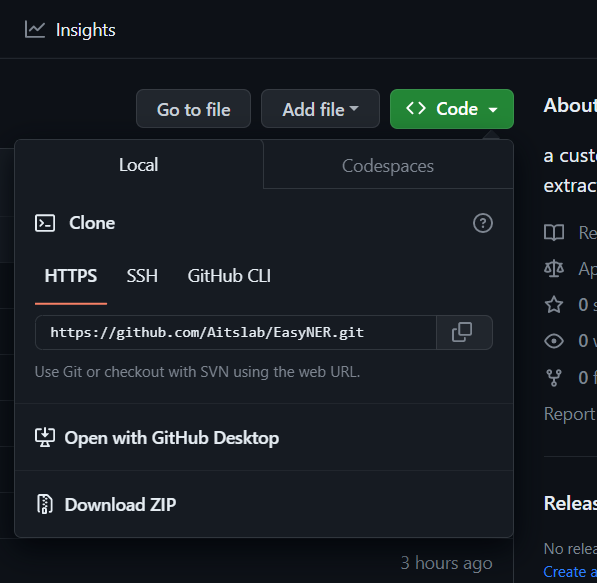

# EasyNER Installation and Useage


The end-to-end NER pipeline for information extraction is designed to process text provided by the user and extract a list of entities. The figure above describes how the given text is processed through the pipeline. Following are step-by-step instructions on installing and running the NER pipeline.

___

# 1. Installation

## 1.1 Install Python
EasyNER is written in the Python programming language. Before you use EasyNER, you need to install Python. The easiest way to do this is to use Anaconda. 
Anaconda can be downloaded from https://www.anaconda.com/ and step-by-step installation instructions can be found on https://docs.anaconda.com/anaconda/install/index.html.  

EasyNER requires very little knowledge of Python but you probably find it easier to use if you watch our [Python tutorial](https://youtu.be/yDNBdB59J1s) on YouTube.
The notebook for the tutorial can be found [here](https://github.com/COMPUTE-LU/PLGroup_PythonforBeginners/blob/main/kickoff_tutorial_20210127.ipynb). You can open the notebook by copying it to google drive and then loading it in colab (see our [tutorial for colab](https://github.com/Aitslab/training/blob/master/tutorials/colab.md)). 

EasyNER was developed using Python version 3.9 but also works with other Python versions. If you do encounter issues, install Python 3.9.


## 1.2 Download the EasyNER GitHub repository

If you have Git installed on the computer, open a terminal window and download the repository by writing: 

```
cd PATH TO YOUR FOLDER OF CHOICE (e.g. C:/Users/XYZ/)
git clone https://github.com/Aitslab/EasyNER/
```

Alternatively, you can download the repository from github page https://github.com/Aitslab/EasyNER to your designated folder as a zip file (click on 'Code' in the top right corner and then on 'Download ZIP') and unpack it to obtain the EasyNER folder



The EasyNER folder includes subfolders with the scripts, data and dictionaries needed to run EasyNER and subfolders for your models and results.


## 1.3 Create the conda environment

Conda environments make it possible to install and manage specific versions of software and their dependencies without interfering with other project. It is best to install EasyNER in a new environment. To install the necessary packages for running the environment, open a conda terminal (called "Anaconda prompt" in the Windows program list) and navigate to the EasyNER folder you downloaded using the change directory command (cd). For example:
```bash
(base) C:\Users\YOURUSERNAME>cd C://Users//YOURUSERNAME//Documents//git_repos//EasyNER
```

Then create a new environment called "easyner_env" by writing the following command:

```bash
conda env create -f environment.yml
```

If you get an error "CondaValueError: prefix already exists" open the environment.yml file which is located in the main folder of the EasyNER folder and change the name of the environment name in the first row.

After installation, load the environment in the conda terminal with this:

```bash
conda activate easyner_env
```

Then download the spaCy models like this:
```bash
python -m spacy download en_core_web_sm
python -m spacy download en_core_web_trf
```
___


# 2. Modify the Config file

EasyNER consists of several modules which are run in a sequential manner using the main.py script (see section 3). It is also possible to run the modules individually. For example, when two NER models are to be used, the first run typically includes a data loader, the Sentence splitter, the NER module and analysis module for the first model and the subsequent run includes only the NER module and analysis module for the second model.

For each run, the config.json file in the EasyNER folder needs to be modified with the desired settings and file paths. This can be done in any text editor. First, the modules that you want to run, should be switched to "false" in the ignore section. Then, the sections for those modules should be modified as required. It is advisable to save a copy of the modified config file elsewhere so you have a permanent record of the run. 

```bash
{
  "ignore": {
    "cord_loader": true,
    "downloader": true,
    "text_loader": true,
    "pubmed_bulk_loader": false,
    "splitter": true,
    "ner": true,
    "analysis": false,
    "merger": true,
    "add_tags": true,
    "re": true,
    "metrics": true
  },
```
In a standard pipeline run, the following modules should be set to false (and the rest to true):

1. One of the data loaders depending on the input type (downloader, cord_loader, free_text loader or pubmed_bulk_loader).
2. splitter
3. ner
4. analysis

#### Runtime measurements
The runtime for EasyNER and the modules can be obtained by setting "TIMEKEEP" on top of the config file to "true". The runtime will be storerd in seconds in the file "timekeep.txt" in the main EasyNER folder (same folder as the config file).

#### CPU limit:
You can specify the number of CPUs to be used in the case of parallel runs by setting the "CPU_LIMIT" on top of the config file to the desired number. If the number is higher than the available CPUS, one less CPU than those available is used.

When the config file is updated, save it and start the run (see step 3.).

The following sections will provide more detail on each of the modules and instructions for the config file.

___

## 2.1 Data loader modules

The EasyNER pipeline has four diffent modules for data loading, which handle different input types:
- List of PubMed IDs => Downloader module
- PubMed database => Pubmed bulk loader module
- CORD-19 metadata.csv file => CORD loader module
- Plain text => Text loader module

There is also a free-standing script to convert PubTator files. When you want to process JSON files as input, you can jump over the Data loader step.

The data loader modules convert the respective input files to one or several JSON files (depending on which data loader module you are using) containing the document collection. These will be placed in the designated output folder and can be processed further by the other EasyNER modules. If the other modules are not run directly, the downloaded files can be saved and the pipeline can be started at the sentence splitter module later.

Example of the generated JSON file:


### 2.1.1 Downloader
The Downloader module takes a single .txt file with pubmed IDs (one ID per row) as input and uses an API to retrieve abstracts from the PubMed database. The output consists of a single JSON file with all titles and abstracts for the selected IDs. 

As example for the input, look at the file ["Lund-Autophagy-1.txt"](/data/Lund-Autophagy-1.txt). The easiest way to create such a file is to perform a search on Pubmed and then save the search results using the "PMID" format option:


To run the Downloader module, change "downloader" in the ignore section of the config file to false (cord_loader, text_loader and pubmed_bulk_loader to true) and provide the following arguments in the "downloader" section of the config file:

#### Config file arguments:

- "input_path": path to file with pubmed IDs 
- "output_path": path to storage location for output
- "batch_size": number of article records downloaded in each call to API. Note that a too large batch size may result in invalid download requests.

#### example: 


The output of the Downloader is a single JSON file with the document collection.

### 2.1.2 PubMed Bulk loader

The entire PubMed abstract collection is available for download in the form of an [annual baseline](https://ftp.ncbi.nlm.nih.gov/pubmed/baseline/), updated only once per year, and [nightly update files](https://ftp.ncbi.nlm.nih.gov/pubmed/updatefiles/). You can read more about this [here](https://ftp.ncbi.nlm.nih.gov/pubmed/README.txt) and [here](https://pubmed.ncbi.nlm.nih.gov/download/). The abstracts are bundled into a large number of gz files. The baselie version number is indicated in the file names after the word "pubmed" and the second number **without the starting zeros** is the file number, e.g. pubmed24n0001.xml.gz has the baseline version 24 and the file number 1.

The PubMed bulk loader variant of the dataloader module can download the annual baseline and nightly update files and converts the gz files into JSON files. In addition a list of the downloaded PMIDs is generated (pmid.txt) and the number of files in each gz file can be counted automatically. Note that the download of the entire article collection requires enough storage space on your computer and may take several hours. An err.txt file is generated to keep track of files that are not downloaded. Missing files can be downloaded in a second EasyNER run or manually from the ftp sites of the baseline and update files. If the err.txt file is empty no errors occured.

Similar to other data loader modules, to run this data loader turn "pubmed_bulk_loader" in the ignore section to "false" (and data_loader, cord_loader and text_loader to "true") and provide the following arguments:

#### Config file arguments:
- "output_path": Path to the folder in which the output files (JSON files, PMID list and the files with counts (optional) are to be saved
- "baseline": The PubMed annual baseline version listed in the file names, e.g. 24 in pubmed24n0001.xml.gz
- "subset": Set tp "true" if a subset of the baseline is to be downloaded, otherwise "false" downloads the entire baseline.
- "subset_range": Specify a range of file numbers (without the starting zeros) if a subset of files is to be downloaded, e.g. to download files numbered 1 to 160 (inclusive) add [1,160],
- "get_nightly_update_files": Set to "true" if nightly update files are to be downloaded alongside the annual baseline, otherwise set to "false". Note that a range must be provided under "update_file_range" if this is set to "true".
- "update_file_range": Provide the range of update files to be downloaded if "get_nighly_update" is set to "true", e.g. [1167,1298] to download files 1167 to 1298 (inclusive). To see the available files, check: https://ftp.ncbi.nlm.nih.gov/pubmed/updatefiles/
- "count_articles": Set to "true" if the number of articles within each file is to be counted and stored in a file called count.txt in the output folder. Otherwise, set to "false".
- "raw_download_path": Path to the folder where the gz files and err.txt file are to be saved. If it is left empty ("raw_download_path": "") the gz files and error file are not saved.

If you only want to download the update files, set subset and get_nightly_update_files to "true" and subset_range to [0,0]. Then define the range of update files under update_file_range.

If not all the files you defined were downloaded, there might be an issue with the PubMed server. Try again later.

If the script gets interrupted you can restart the download by specifying the remaining batch as a subset. For this, you use the number of the last file that was downloaded in the first batch as start number for the subset of the second batch and the last file number as the end number of the subset. As long as you keep all of the already downloaded files of the first batch in the same folder as the second batch, both batches will be converted to JSON together in the second part of the script.

#### example: 


The output of the PubMed Bulk loader is a folder with JSON files, each file containing the document collection from a its corresponding PubMed bulk file and named with the same number, e.g. pubmed25n1280.json.

### 2.1.3 CORD loader

[CORD-19 dataset](https://github.com/allenai/cord19) is a large collection of SARS-CoV2-related articles updated until 2022-06-02. The cord_loader variant of the data loader module processes titles and abstracts in the CORD-19 metadata.csv file. To use the cord_cord loader, CORD-19 needs to be downloaded manually ([direct download link](https://ai2-semanticscholar-cord-19.s3-us-west-2.amazonaws.com/historical_releases/cord-19_2022-06-02.tar.gz)). The downloaded gz file should then be unpacked and the metadata.csv file placed in the desired input folder. The file path to the metadata.csv file should then be provided in the config file as input path. By default, the module will process all titles and abstracts in the CORD-19 dataset (approximately 700 000 records). If a smaller subset is to be processed, a .txt file with the selected cord UIDs, which can be extracted from the metadata.csv file, needs to be provided. To run the CORD loader script, turn "cord_loader" in the ignore section to false (and downloader, pubmed_bulk_loader and text_loader to true) and provide the following arguments:

#### Config file arguments:

- "input_path": input file path for CORD-19 metadata.csv file
- "output_path": path to storage location for output files
- "subset": true or false - whether a subset of the CORD-19 data is to be extracted.
- "subset_file": input file path to a file with cord UIDs if subset option is set to true

#### example: 


The output of the CORD loader is a single JSON file with the document collection.

### 2.1.4 Text loader

The text_loader variant of the dataloader module processess plain text in .txt format and converts it into a JSON file. Word documents and other similar files need to be converted to .txt before using them with EasyNER. Similar to data_loader and cord_loader, the file path should be provided in the config files. The output JSON file will contain entries with prefix and a number as IDs and the filename as title. The number is randomly assigned. To run the text_loader script, turn "text_loader" in the ignore section to false (and downloader, pubmed_bulk_loader and cord_loader to true) and provide the following arguments:


#### Config file arguments:
- "input_path": path to input folder with one or several .txt files.
- "output_path": output file (JSON format)
- "prefix": name to be used as document identifier in the output JSON file (instead of the PMID or CORD UID)

#### example: 


The output of the freetext loader is a single JSON file with the text in the document collection format.

### 2.1.5 PubTator files
When using the pipeline with PubTator files, a separate script is used instead of a Data Loader to produce the document collection that can then be processed by the Sentence Splitter module. Place the PubTator files in a folder and then run the script [convert_hunfliar2_pubtator-to-json.py](https://github.com/Aitslab/EasyNER/blob/main/supplementary/experiment_scripts/convert_hunflair2_pubtator_to_json.py). The output of this script is a single JSON file with the document collection without any of the PubTator annotations.

[Example of the PubTator format](https://github.com/Aitslab/EasyNER/blob/main/tutorials/Tutorial-benchmarking_entitylevel.md)

### 2.1.6 JSON files
When processing a single JSON file or a folder of JSON files the data loader step can be skipped and the file(s) can be used directly as input for the Sentence Splitter module.
___

## 2.2 Sentence Splitter module

This module loads the document collection generated by one of the data loaders (or files in the same [format](imgs/output_downloader.png)) and splits the text into sentences with the spaCy or NLTK sentence splitter. The input document collection can be in the form of a single JSON file (when using all data loaders except the PubMed bulk loader) or in a folder with multiple JSON files (when using the PubMed bulk loader). When using a folder of JSON files not generated by one of the EasyNER data loaders the files need to be renamed to match the PubMed file naming structure, i.e. "pubmed25n" followed by a 4-digit number (pubmed25n0001.json, pubmed25n0002.json, etc).

To run the sentence splitter module set the ignore parameter for splitter in the config file to false. When using the spaCy option, the user needs to choose the model: "en_core_web_sm" or "en_core_web_trf". 

#### Config file arguments:
- "input_path": input file path to the document collection (either a single JSON file or a folder of JSON files produced by the data loaders or a file/folder in the same format). 
- "output_folder": output folder path where the produced JSON files will be saved
- "output_file_prefix": first part of the output file name, e.g. "sentences"
- "pubmed_bulk": set to "true" if the PubMed Bulk Downloader is used before the Splitter module or if a folder with JSON files in the same format is to be processed; if one of the other data loaders is used before the Splitter module or a single JSON file is to be processed set to "false"
- "file_limit": when using a folder specify the number of the files that are to be processed (PubMed bulk file numbers)
- "tokenizer": "spacy" or "nltk"
- "model_name": "en_core_web_sm" or "en_core_web_trf" for spaCy, for nltk write "" 
- "batch_size": number of texts to be saved in each JSON output file, typically between 100 and 1000; only relevant when using a single JSON file as input (when using a folder as input each file in the input folder will produce a corresponding JSON output file).


#### examples: 


The output is one or several JSON files with the document collection split into sentences. The number of documents stored in the same JSON output file is specified under "batch_size". 

#### common errors:

If the Splitter module runs but no output file is generated, the input files are most likely not named in the expected manner, see above.

If you get this error you forgot to dowload the spaCy models when creating the conda environment (see step 1.3):
```bash
OSError: [E050] Can't find model 'en_core_web_sm'. It doesn't seem to be a Python package or a valid path to a data directory.
```


If you get this error you used a folder in the "input_path" but forgot to set pubmed_bulk to "true"
```bash
PermissionError: [Errno 13] Permission denied: 'data/splitter/input/'
```


___

## 2.3 Named Entity Recognition module

The NER module performs NER on JSON files containing document collections split into sentences (normally the output files from the Sentence Splitter module). The user can use deep learning models (see section 2.3.1) or dictionaries (see section 2.3.2) for NER. The dictionary option is much faster but only recognizes the exact terms provided in the dictionary file.

To run this module, the ignore argument for ner should be set to false and the following config arguments should be specified in the config file:

#### Config file arguments:
- "input_path": input folder path where all JSON batch files (typically the output folder of the Sentence Splitter) with texts split into sentences are located
- "output_folder": output folder path where each batch will be saved, e.g. you can create a new subfolder in the EasyNER "results" subfolder
- "output_file_prefix": first part of the output file name, e.g. "ner_disease"
- "model_type": type of model; the user can choose between "biobert_finetuned" (deep learning models) and "spacy_phrasematcher" (dictionary-based NER)
- "model_folder": For HuggingFace models use the repo name, e.g. "aitslab" for our BioBERT_HUNER models. For locally stored models, add the path to folder where the model is located. 
- "model_name": when using a deep learning model for NER, enter the name of the model exactly as it is on HuggingFace (e.g. "biobert_bc5cdr_disease_v1") or in the file name for a locally stored model; when using a dictionary for NER, enter the name of a spaCy model, normally the same that was used in the Sentence splitter ("en_core_web_sm" or "en_core_web_trf")
- "vocab_path": path to dictionary (if this option is used), e.g. "dictionaries/covid-19_synonyms_v2.txt"
- "store_tokens": default is "no"; choose "yes" if all tokens produced from the sentence should be stored in the JSON output files (which can help with error analysis); only relevant for dictionary-based NER
- "labels": if specific lavels are to be provided, these should be given as a Python list (encased in [] brackets without quotation marks around them) e.g. "labels": ["[PAD]", "B", "I", "O", "X", "[CLS]", "[SEP]", "[MASK]", "[UNK]"]; only relevant for ONNX models
- "clear_old_results": set to "true" to overwrite old results
- "article_limit": if user decides to only choose a range of articles in the input_folder to process, default [-1,90000]
- "entity_type": type of extracted entity, e.g. "gene"
- "multiprocessing": set to "true" to use CPUs and multiprocessing; when set to "false" GPU is used if available

If # is removed from the start of line 84 of the [ner_main.py script](https://github.com/Aitslab/EasyNER/blob/main/scripts/ner_main.py) before running the pipeline the term specified as "entity_type" will be added to each annotation in the JSON files. This increases file size and memory requirments and is thus not used by default.

#### example: 


The output is one or several document collection JSON files, in which the texts are split into sentences and annotated entities and their position (starting character and end character) are listed for each sentence. An example output file is [here](https://github.com/Aitslab/EasyNER/blob/main/results/sample_output/ner_huner_gene-1.json).

### 2.3.1 [BioBERT](https://github.com/dmis-lab/biobert-pytorch)-based NER
When using a deep learning model, you can use one of the BioBERT-based pytorch models we fine-tuned on the [HUNER corpora](https://github.com/hu-ner/huner), which are available from the [Aitslab Huggingface repository](https://huggingface.co/aitslab). Alternatively, you can use other models from HuggingFace repositories or your own model stored in the EasyNER "model" folder (as long as it is in the same format).

Recommended models:
1. Cells/cell lines: biobert_huner_cell_v1 
2. Chemicals (including drugs): biobert_huner_chemical_v1
3. Disease (including symptoms): biobert_huner_disease_v1
4. Gene/protein: biobert_huner_gene_v1
5. Species: biobert_huner_species_v1

When loading models from HuggingFace set the "model_path" to the repo name (i.e. "aitslab" for our BioBERT_HUNER models) and "model_name" to the model name as it is spelled on HuggingFace in the NER section of the config file. When using a model stored locally on the computer, specify the path to the model in "model_path".


#### example:

```console
"model_type": "biobert_finetuned",
"model_path": "aitslab",
"model_name": "biobert_huner_chemical_v1"
```

### 2.3.2 Dictionary-based NER
The dictionary option makes use of the [spaCy Phrasematcher](https://spacy.io/api/phrasematcher). You can either use one of the dictionaries that are included with EasyNER in the ["dictionaries"](dictionaries/) subfolder or create your own dictionary in the form of a .txt file with one term per line. 

The EasyNER dictionary folder contains dictionaries for the following:
- COVID-19 and its synonyms
- SARS-CoV2 and its synonyms
- SARS-CoV2 variant names
 
Dictionary based NER can be run by specifying model_type as "spacy_phrasematcher", "model_name" as the spacy model (ideally use the same model as for the splitter,  "en_core_web_sm" or "en_core_web_trf") and specifying the "vocab_path" (path_to_dictionary) in the NER section of the config file. 

#### example:

```console
"model_type": "spacy_phrasematcher",
"model_path": "",
"model_name": "en_core_web_sm",
"vocab_path": "dictionaries/sars-cov-2_synonyms_v2.txt"
```
___


## 2.4 Analysis module

This section quantifies the annotated entities from a single class (does not run of merged files with mutliple classes!) and produces a list of ranked entities and frequency plot. First, as all the other steps above, set ignore analysis to false. Then use the following input and output config arguments:

#### Config file arguments:
- "input_path": input folder path where all batches of NER are located,
- "output_path": output folder path where the analysis files will be saved,
- "entity_type": type of entity, this will be added as a prefix to the output file and bar graph,
- "plot_top_n": plot top n entities. defaults to 50. Note that plotting more than 100 entities can result in a distorted graph

#### example: 


#### output:

1. File with ranked entity list:

The generated output file contains the following columns:

| Column | Description |
| --- | ---|
| entity | Name of the entity |
| total_count | total occurances in the entire document collection (across all processed files) |
| articles_spanned | number of documents (abstracts) in which the entity is found |
| batches_spanned | number of batches in which the entity is found |
| freq_per_article | total_count/articles_spanned |
| freq_per_batch | total_count/batches_spanned |
| batch_set | batch IDs of the batches in which the entity is found |
| batch_count | no of times the entity is found in each batch |
| articles_set | document IDs (e.g. PMIDs, CORD UIDs) of the documents in which the entity is found |


2. Bar graph of frequencies:


___

## 2.5 File Merger module

The File Merger module combines results from multiple NER module runs into a single file for analysis. First, as all the other steps above, set ignore analysis to false. Then use the following input and output config arguments:

#### Config file arguments:
- "input_paths": list of input folder path where the files are saved. for example: ["path/to/cell/model/files/", "path/to/chemical/model/files/", "path/to/disease/model/files/"]   
- "entities": list of entities correcponding to the models. For example: ["cell", "chemical", "disease"]
- "output_path": output path where the medged file will be saved

Note that only files that contain the same document collection (i.e. files produced with the same batch_size in the Sentence Splitter) can be merged and that these are matched by the numeric suffix. Merged files with multiple entity classes cannot be run in the analysis module.
___


## 2.6 Metrics module


The metrics module is not part of the NER annotation workflow but can instead be used to evaluate the performance of NER models/dictionaries on token level. It calculates precision, recall and F1 scores by comparing an IOB2-formatted file with predictions with an IOB2-formatted file with the true annotations (ground truth). An IOB2 file contains one token per line, followed by a separator and a label (B, I or O). B is the label for the first token of the entity, I is the label of the subsequent tokens of the entity and O is for tokens that do not belong to an entitity. As an example for IOB2 files, you can look at the files in the [Simplified Lund COVID-19 corpus](https://github.com/Aitslab/EasyNER/blob/main/data/Simplified%20Lund%20COVID19%20corpus.zip).

To run the metrics module, set ignore metrics to false in the config file. Then use the following input and output config arguments:

#### Config file arguments:
- "predictions_file": file containing predictions by the chosen model (in IOB2 format),
- "true_file": file containing true (annotated) values (also in IOB2 format),
- "output_file": file to store precision, recall and f1 scores,
- "pred_sep": seperator for predictions file which separates the tokens and labels, default is " ",
- "true_sep": seperator for true annotations file, e.g. " " or "\t" (for tab-separated file)

#### example:


#### Output

```console

              precision    recall  f1-score   support

           _    0.67557   0.65274   0.66396      1627

   micro avg    0.67557   0.65274   0.66396      1627
   macro avg    0.67557   0.65274   0.66396      1627
weighted avg    0.67557   0.65274   0.66396      1627

```

#### errors:
ValueError: max() arg is an empty sequence

This error is caused by incorrect separators specified in pred_sep and true_sep.
___


## 2.7 Post-processing module (free-standing script)
For entities containing a hyphen or brackets (regular, square or curly) which were incorrectly fragmented in the NER process, a separate [post-processing script](https://github.com/Aitslab/EasyNER/blob/main/supplementary/experiment_scripts/postprocess_separator_merging.py) is available which processes the EasyNER output files and merges the fragments. To process EasyNER JSON files with annotations with the script follow these steps:

1. Open the script file and in the bottom in line 169 replace 'path/to/folder/with/easyner_json_files/' with the correct input folder to your JSON files
2. Use the cd command in the Anaconda prompt to navigate from the EasyNER main folder to the subfolder containing the modified postprocess_separator_merging.py script
```console
cd supplementary\experiment_scripts
```
2. Run the script by typing
```console
python postprocess_separator_merging.py 
```

___

## 2.8 EasyNER JSON-to-PubTator conversion module (free-standing script)
The annotated JSON document collection files poduced by the EasyNER pipeline can be converted to annotated PubTator files with the JSON-to-PubTator conversion script:[convert_easyner_output_json_to_pubtator.py](https://github.com/Aitslab/EasyNER/blob/main/supplementary/experiment_scripts/convert_easyner_output_json_to_pubtator.py).
___

# 3. Run EasyNER pipeline

When the updated config file is saved, the EasyNER pipeline can be run by activating the easyner_env environment in the conda terminal (Anaconda Prompt), navigating to the easyner folder with the "cd" command, and starting the main.py file in the conda terminal:

```bash
conda activate easyner_env
```


```bash
(easyner_env) C:\Users\YOURUSERNAME>cd C://Users//YOURUSERNAME//Documents//git_repos//EasyNER
```


```bash
(easyner_env) C://Users//YOURUSERNAME//Documents//git_repos//EasyNER>python main.py
```

The output files are placed into your designated output folder. When the run is completed "Program finished successfully will appear in the conda terminal:


